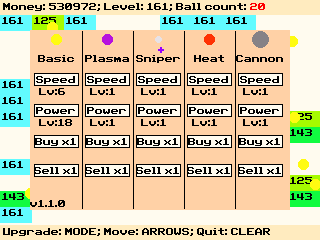
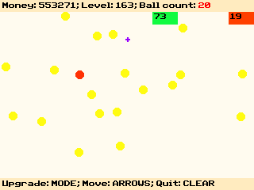

# Tile Breaker
Fun TI-84 Plus CE idle game in which you destroy tiles with balls that bounce around the screen. Tiles increase their health per level, so you will need to upgrade your balls' speed and power to keep up. See how much money you can make!

This game uses the <a href="https://github.com/CE-Programming/toolchain">CE C Toolchain</a> to render things to the screen.

## How the Game Looks

## Downloading the Game
1. Go to the <a href="https://github.com/kensoto-martinez/tile-breaker-ce/releases/tag/v1.1.0">latest release</a> and install the compressed folder.

2. The compressed folder contains `clibs.8xg` and `tilebrkr.8xp`. Put these files on your calculator via <a href="https://education.ti.com/en/products/computer-software/ti-connect-ce-sw">TI-Connect CE</a> or an alternative.

3. New calculator versions don't let you directly launch programs. If your calculator doesn't let you run programs, put <a href="https://yvantt.github.io/arTIfiCE/">arTIfiCE</a> on your calculator as well. It's a program that lets you run `.8xp` files, such as my game. The link has a tutorial on how to set it up.
